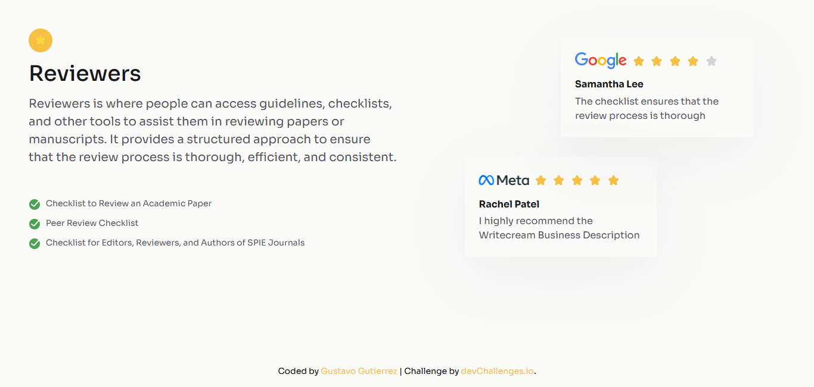

<!-- Please update value in the {}  -->

<h1 align="center">Testimonial Page | devChallenges</h1>

   Solution for a challenge <a href="https://devchallenges.io/challenge/testimonial-page" target="_blank">Testimonial Page</a> from <a href="http://devchallenges.io" target="_blank">devChallenges.io</a>.

  <h3>
    <a href="https://gustavo2023.github.io/testimonial-page/">
      Demo
    </a>
     | 
    <a href="https://devchallenges.io/solution/43011">
      Solution
    </a>
     | 
    <a href="https://devchallenges.io/challenge/testimonial-page">
      Challenge
    </a>
  </h3>

<!-- TABLE OF CONTENTS -->

## Table of Contents

- [Overview](#overview)
  - [What I learned](#what-i-learned)
- [Built with](#built-with)
- [Features](#features)

<!-- OVERVIEW -->

## Overview

### What I learned

Learned about how to use CSS Grid to create more complex and flexible layouts. By defining grid containers and grid items, I can control the placement and sizing of elements in a responsive manner.

This also makes it straightforward to create responsive designs. By adjusting the grid properties within media queries, I can change the layout based on the screen size, ensuring a consistent user experience across devices.

CSS Grid can be combined with other layout methods like Flexbox. For example, using Flexbox for internal alignment within grid items provides additional flexibility and control over the positioning of different elements.

### Built with

- Semantic HTML5 markup
- CSS custom properties
- Flexbox
- CSS Grid

## Features

Simple testimonial page made using CSS Grid and Flexbox.

This application/site was created as a submission to a [DevChallenges](https://devchallenges.io/challenges-dashboard) challenge.

## Author

- GitHub [@gustavo2023](https://github.com/gustavo2023)
